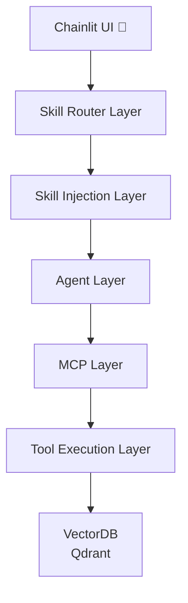

# agent-retrieval-system

> 🚧 This project is under active development. 
> Some layers and advanced orchestration features are still evolving.
> 
## Concept
A modular AI agent system that combines LLM reasoning, tool orchestration (MCP), and vector database retrieval.  
This project demonstrates how to build a scalable agent architecture with clear separation between reasoning, tools, and data layers.

---

This project demonstrates an Agent + Retrieval system designed for complex user queries.

Instead of relying on a single RAG pipeline, the system introduces:

- LLM reasoning
- Tool-based orchestration via MCP
- Retrieval (vector search)
- Dynamic skill injection

---

## Example Query

> "Find a comedy movie I haven't watched, directed by a director I frequently watch, around 10 years ago."

---

## System Architecture


## DEMO
Example:  
Q: Please recommend some movies by my favorite directors that I haven't seen yet.  
A: You should watch *Oppenheimer* (2023), *The Prestige* (2006), and *Batman Begins* (2005). You have already seen *Interstellar* and *Tenet*.

# Project Structure

```text
agent-retrieval-system/
│
├── src/
│   ├── agent/
│   ├── mcp/
│   ├── routers/
│   ├── skills/
│   └── vectordb/
│
├── data/
├── README.md
└── .env
```