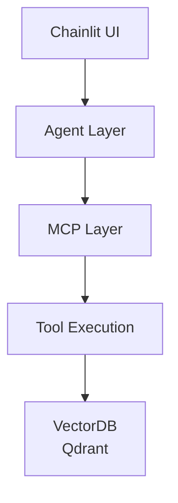

# agent-retrieval-system

> 🚧 This project is under development. Some layers (services, skills) are not yet implemented.
> 
## Concept
A modular AI agent system that combines LLM reasoning, tool orchestration (MCP), and vector database retrieval.  
This project demonstrates how to build a scalable agent architecture with clear separation between reasoning, tools, and data layers.

---

This project demonstrates an Agent + Retrieval system designed for complex user queries.

Instead of relying on a single RAG pipeline, the system introduces:

- Tool-based orchestration via MCP
- Retrieval (vector search)
- Separation of reasoning (Agent) and execution (Tools)

> 🚧 Skill-based decomposition and dynamic prompt injection are planned but not yet implemented.

---

## Example Query

> "Find a comedy movie I haven't watched, directed by a director I frequently watch, around 10 years ago."

---

## System Architecture

## DEMO
Example:  
Q: Please recommend some movies by my favorite directors that I haven't seen yet.  
A: You should watch *Oppenheimer* (2023), *The Prestige* (2006), and *Batman Begins* (2005). You have already seen *Interstellar* and *Tenet*.
