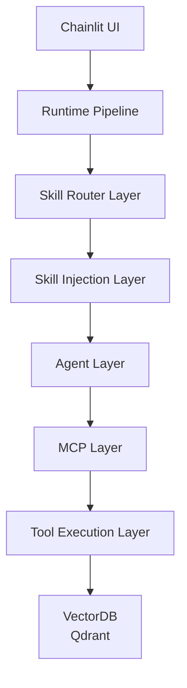

# agent-retrieval-system

> 🚧 This project is under active development. 
> Some layers and advanced orchestration features are still evolving.
> 
## Concept
A modular AI agent system that combines LLM reasoning, tool orchestration (MCP), and vector database retrieval.  
This project demonstrates how to build a scalable agent architecture with clear separation between reasoning, tools, and data layers.

---

This project demonstrates an Agent + Retrieval system designed for complex user queries.

Instead of relying on a single RAG pipeline, the system introduces:

- LLM reasoning
- Tool-based orchestration via MCP
- Retrieval (vector search)
- Skill-based task decomposition
- Skill-based prompt loading
- Skill-based tool resolution
- Runtime tool execution tracing

---

## System Architecture



## Run

```bash
chainlit run src/ui/chainlit_app.py --port 8001
```

## DEMO
Example:  

User:
> Please recommend some movies by my favorite directors that I haven't seen yet.  

Agent execution:
```text
Selected skills:
- exclude_watched_movies
- movie_recommendation_by_director

Resolved tools:
- get_watched_movies 
- get_favorite_director
- movie_search_tool

Tool execution:
- calling get_favorite_director
- calling movie_search_tool
- calling get_watched_movies
```
Response:
```text
Here are some movies directed by Christopher Nolan that you haven't seen yet:

title: Oppenheimer
director: Christopher Nolan
rating: 8.031
overview: The story of J. Robert Oppenheimer's role in the development of the atomic bomb during World War II.

title: The Prestige
director: Christopher Nolan
rating: 8.206
overview: A mysterious story of two magicians whose intense rivalry leads them on a life-long battle for supremacy -- full of obsession, deceit and jealousy with dangerous and deadly consequences.

title: Batman Begins
director: Christopher Nolan
rating: 7.723
overview: Driven by tragedy, billionaire Bruce Wayne dedicates his life to uncovering and defeating the corruption that plagues his home, Gotham City. Unable to work within the system, he instead creates a new identity, a symbol of fear for the criminal underworld - The Batman.
```

# Project Structure

```text
agent-retrieval-system/
│
├── src/
│   ├── agent/
│   ├── mcp/
│   ├── routers/
│   ├── skills/
│   ├── ui/
│   ├── vectordb/
│   ├── main.py
│   └── runtime.py
│
├── eval/
├── data/
├── README.md
└── .env
```