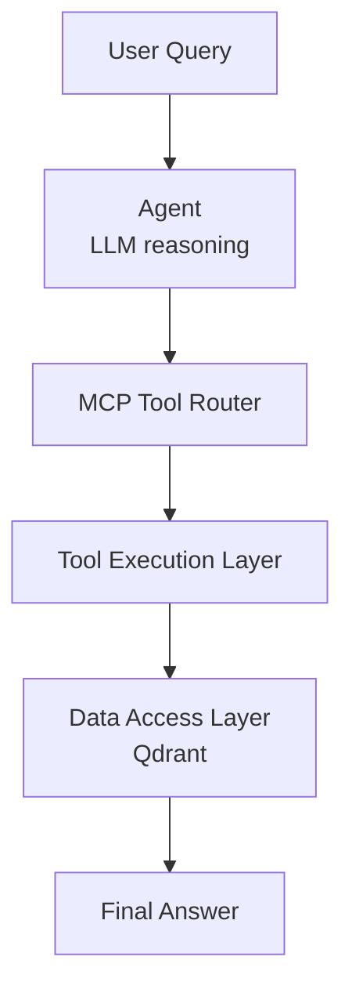

# Agent Layer

## Responsibility
This layer is responsible for:
- Orchestrating LLM reasoning
- Selecting and calling tools via MCP
- Handling tool call streaming

---
## Components

### create_agent()
- Initializes FunctionAgent
- Loads tools from MCP server
- Injects system prompt

### run_agent_verbose()
- Executes agent
- Streams tool call events
- Prints debugging logs

---
## Tools Used
- `movie_search_tool`
- `get_favorite_director`
- `get_watched_movies`

---
## Flow

---
## Design Principles
- The agent is responsible only for reasoning and orchestration
- Business logic is handled in the service layer
- Data access is isolated in repositories
- Tools act as thin interfaces between agent and services