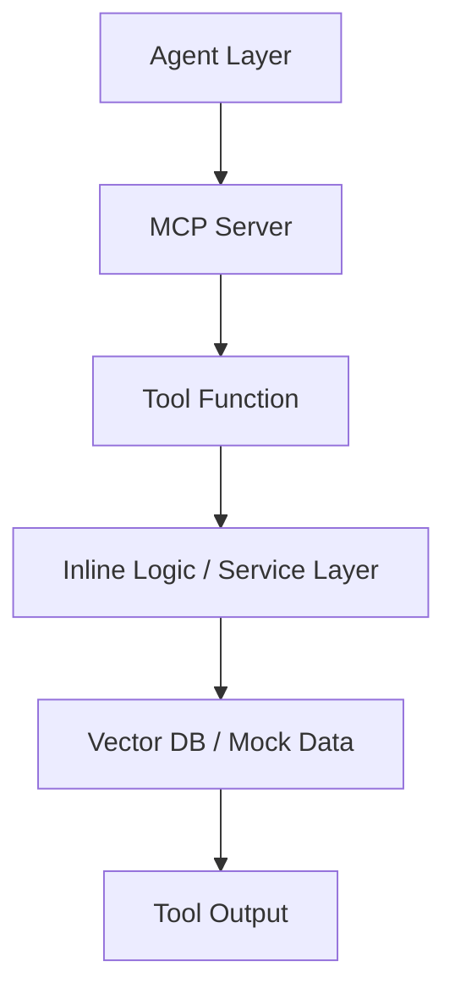

# MCP Layer

## Responsibility
This layer is responsible for:
- Exposing tools via MCP protocol
- Acting as an interface between Agent and backend logic
- Handling input validation and tool execution

---
## Components

### FastMCP Server
- Registers tools using `@mcp.tool()`
- Exposes tools over HTTP
- Serves as the entry point for tool calls from the agent

---
## Tools

### `movie_search_tool`
- Performs semantic search over movie data (Qdrant)
- Supports optional filters:
  - `director`
  - `year`
  - `min_rating`
- Requires a `query` string for embedding-based retrieval

### `get_favorite_director`
- Returns the user's most frequently watched director
- Based on user watch history

### `get_watched_movies`
- Returns a list of movie titles the user has already watched

---
## Flow

---
## Design Principles
- MCP tools act as thin interfaces between agent and logic
- Each tool should have a clear, single responsibility
- Input parameters must be explicit and validated
- Business logic should eventually be moved to service layer