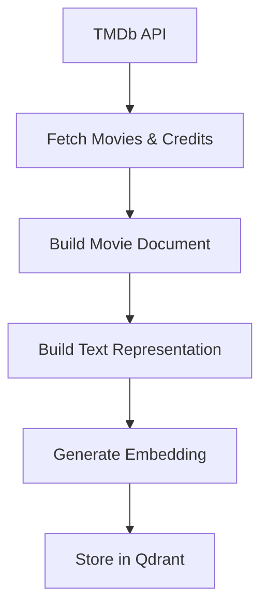

# VectorDB Layer

## Responsibility
This layer is responsible for:
- Fetching movie data from external APIs (TMDb)
- Transforming raw data into structured documents
- Generating embeddings from text
- Ingesting data into the vector database (Qdrant)

---
## Components

### TMDb Fetching
- `fetch_movies()`
  - Retrieves movie data using TMDb discover API
- `fetch_director()`
  - Fetches director information for each movie

### Data Processing
- `build_movie_doc()`
  - Constructs structured movie objects
  - Includes metadata such as title, rating, director, and poster URL

### Text Builder
- `build_text()`
  - Converts structured movie data into embedding-friendly text format

### Embedding
- Uses `SentenceTransformer (all-MiniLM-L6-v2)`
- Generates dense vector representations of movie descriptions

### Qdrant Initialization
- `init_qdrant()`
  - Creates collection if not exists
  - Configures vector size and similarity metric (COSINE)
  - Applies HNSW indexing parameters

---
## Flow

---
## Design Principles
- Separate data ingestion from query logic
- Keep embedding pipeline simple and reproducible
- Store raw metadata as payload for flexible filtering
- Ensure idempotent ingestion (safe to re-run)

---

## Notes
- Uses TMDb API (/discover/movie and /credits)
- Language is currently set to en-US
- Rate limiting is handled via time.sleep(0.2)
- Embedding model dimension is inferred dynamically
- Data is stored locally using Qdrant (path="qdrant_data")

---
## Future Improvements
- Add multi-language support (e.g., ja-JP)
- Support batch ingestion / parallel requests
- Move embedding + ingestion into pipeline jobs
- Introduce image embeddings for poster-based search
- Replace local Qdrant with remote service (Docker / Cloud)
